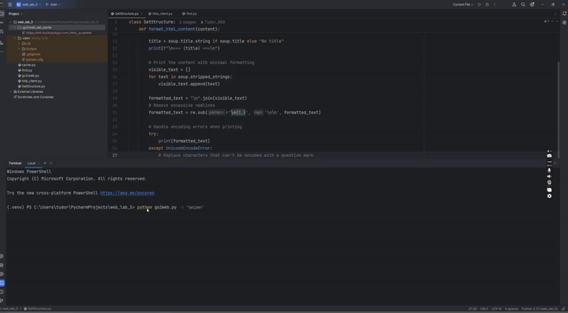

# Go2Web CLI Tool

Go2Web is a simple command-line web scraping and search tool that allows you to fetch web pages, search for information online, and navigate through search results.

## Features

- Fetch and display content from any URL
- Search the web using DuckDuckGo
- Format and display HTML or JSON content
- Navigate through search results
- Intelligent caching for faster response times

## TCP (Transmission Control Protocol)

**TCP** is a core protocol of the Internet that provides reliable, ordered, and error-checked delivery of data between applications. It ensures that data packets arrive complete and in the correct sequence by using a connection-oriented approach.

### Key Features:
- Reliable data transfer
- Error detection and correction
- Ensures packet order
- Used in protocols like HTTP, FTP, SMTP

---

## SSL (Secure Sockets Layer)

**SSL** is a cryptographic protocol designed to provide secure communication over a network. It encrypts data transferred between a client and a server to prevent eavesdropping and tampering.


### Key Features:
- Encrypts data in transit
- Authenticates server (and optionally client)
- Ensures data integrity
- Commonly used with HTTPS
- 
## Installation

```bash
git clone https://github.com/yourusername/go2web.git
cd go2web
```

### Basic Commands

```bash
# Fetch a web page
python go2web.py -u https://example.com

# Search for a term
python go2web.py -s "anime"

# Open a specific search result (by number)
python go2web.py -link 8

# Request specific content format
python go2web.py -u https://example.com --json
python go2web.py -u https://example.com --html
```

### Examples

Search for a term:
```bash
python go2web.py -s "anime"
```

Open the third search result:
```bash
python go2web.py -link 6
```

Fetch a specific URL with JSON formatting:
```bash
python go2web.py -u https://myanimelist.fandom.com/wiki/MyAnimeList_Wiki --json
```

## How It Works



## Project Structure

- `go2web.py`: Main application
- `http_client.py`: Handles HTTP requests with caching
- `SetFormat.py`: Formats HTML and JSON content
- `find.py`: Performs web searches via DuckDuckGo
- `cache.py`: Manages response caching

## Dependencies

- BeautifulSoup4: For HTML parsing
- Socket: For network communication
- SSL: For secure connections
- JSON: For handling JSON data
